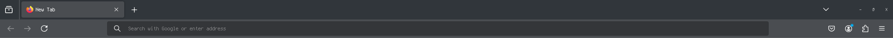
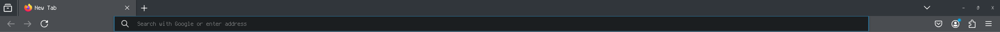

Makes your firefox tabs and url bar smaller

Also allows to press tab close button when there are multiple opened tabs (on hover)

Without:

With:

Set `toolkit.legacyUserProfileCustomizations.stylesheets` in `about:config` and move `userChrome.css` to `YOUR_PROFILE/chrome/`

On Linux
`~/.mozilla/firefox/YOUR_PROFILE/chrome/`

On Windows
`%APPDATA%/Mozilla/Firefox/YOUR_PROFILE/chrome/`